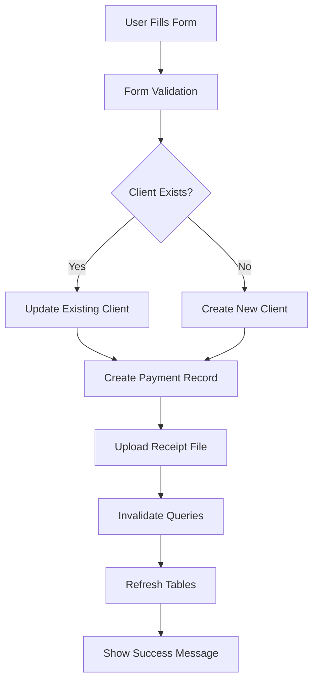

# Deal Form Backend Integration - Complete Guide

## 🎯 Overview

I've successfully connected the deal form in the salesperson dashboard with the backend API. The form now properly submits data and automatically updates the deals table after successful submission.

## 🔧 Changes Made

### 1. **Fixed Client Dropdown Issue** (`DealForm.tsx`)
- **Problem**: Client dropdown was not showing client names due to incorrect API endpoint
- **Solution**: Updated `fetchClients` function to use `/deals/` endpoint instead of `/clients/`
- **Added**: Debug logging to help troubleshoot client data fetching
- **Added**: Loading and "No clients found" states for better UX

### 2. **Fixed Data Transformation** (`DealForm.tsx`)
- **Problem**: The original form was using a complex nested FormData structure that didn't match the backend API expectations.
- **Solution**: Implemented a two-step process:
  1. Create/update the client (deal) record
  2. Create the associated payment record

### 3. **Fixed HTTP 415 Error (Content-Type Mismatch)**
- **Problem**: Backend expects form data but frontend was sending JSON
- **Solution**: Changed client creation to use FormData instead of JSON
- **Technical**: Backend `DealCompatViewSet` uses `MultiPartParser` and `FormParser` only
- **Added**: `putMultipart` method to ApiClient for form-based PUT requests

### 4. **Improved API Integration**
- **Before**: Single complex `postMultipart` call with nested data
- **After**: Separate API calls for client and payment creation
- **Benefits**: Better error handling, clearer data flow, matches backend architecture

### 5. **Enhanced Query Invalidation**
- Added comprehensive query invalidation to ensure tables refresh:
  ```javascript
  queryClient.invalidateQueries({ queryKey: ["deals"] });
  queryClient.invalidateQueries({ queryKey: ["clients"] });
  queryClient.invalidateQueries({ queryKey: ["payments"] });
  ```

### 6. **Smart Client Handling**
- **New Feature**: Form now checks if a client already exists before creating a new one
- **Benefits**: Prevents duplicate clients, supports editing existing deals

### 7. **Better Error Handling**
- Added user-friendly success/error messages
- Graceful handling of payment creation failures
- Detailed error logging for debugging

## 📝 Code Changes Summary

### Key Files Modified:
1. **`app/src/components/salesperson/Deal/DealForm.tsx`**
   - Rewritten `submitDealData` function
   - Improved error handling and user feedback
   - Added support for existing client detection

## 🚀 How It Works Now

### Form Submission Flow:


### API Calls Made:
1. **POST/PUT `/deals/`** - Creates or updates the client/deal
2. **POST `/payments/`** - Creates the payment record with file upload

## 🧪 Testing Instructions

### 1. **Backend Setup**
Make sure your Django backend is running:
```bash
cd Backend_PRS
python manage.py runserver
```

### 2. **Frontend Setup**
Start the Next.js development server:
```bash
cd app
npm run dev
```

### 3. **Test API Connectivity**
Run the provided test script:
```bash
node test_deal_api.js
```

### 4. **Test Client Dropdown** (Important!)
1. Navigate to the salesperson dashboard
2. Go to "Deal Management" page
3. Click "Add New Deal"
4. Click on the "Client Name" dropdown
5. **Expected Behavior**:
   - Shows "Loading clients..." while fetching data
   - Shows list of existing client names if data exists
   - Shows "No clients found" if no data exists
6. **If dropdown is empty**: Check browser console for debug logs

### 5. **Test API Endpoints** (Optional)
```bash
# Run the test script to verify API endpoints
node test-client-api.js
```

### 6. **Manual Testing Steps**
1. Navigate to the salesperson dashboard
2. Go to "Deal Management" page
3. Click "Add New Deal"
4. Fill out the form:
   - **Client Name**: Select existing or enter new
   - **Deal Name**: Enter a descriptive name
   - **Deal Value**: Enter amount
   - **Payment Method**: Select method
   - **Upload Receipt**: Select a PDF file
   - Fill other required fields
5. Click "Save Deal"
6. Verify:
   - Success message appears
   - Form resets
   - Deals table refreshes with new entry
   - Payment appears in deal details

## 🔍 Debugging

### Common Issues:
1. **Client dropdown is empty or not loading**
   - Check browser console for debug logs
   - Verify backend is running on `http://localhost:8000`
   - Check if `/api/deals/` endpoint is accessible
   - Look for CORS issues in network tab

2. **HTTP 415: Unsupported Media Type**
   - **Fixed**: Backend expects form data, not JSON
   - **Solution**: Form now sends FormData instead of JSON
   - **Check**: Look for "Creating client form data" logs in console

3. **"Failed to create client"**
   - Check backend server is running
   - Verify API endpoints are accessible
   - Check authentication token

4. **"Payment creation failed"**
   - Verify file upload is a PDF
   - Check payment data fields
   - Review backend payment model constraints

5. **Table not refreshing**
   - Check React Query cache invalidation
   - Verify query keys match between form and table

### Debug Tools:
- **Browser Console** - View client data fetching logs and errors
- **Browser Network tab** - Check API requests/responses
- **Backend logs** - Django server console output
- **React Query DevTools** - Monitor query states and cache

### Debug Logs to Look For:
```
✅ "Fetched clients from /deals/:" - Shows successful data fetch
✅ "Client data: {id: '...', client_name: '...'}" - Shows individual client data
✅ "Generated dropdown options: [...]" - Shows processed dropdown options
✅ "Creating client form data with: ..." - Shows form submission data
✅ "Client form data contents:" - Shows FormData being sent
✅ "Creating new client with form data..." - Shows client creation attempt
✅ "Client API response: ..." - Shows successful API response
❌ "Failed to fetch clients: ..." - Shows API errors
❌ "Clients query state: {clientsError: ...}" - Shows query errors
❌ "HTTP 415: Unsupported Media Type" - Content-Type mismatch (now fixed)
```

## 🎉 Features Working Now

✅ **Form Submission** - Successfully creates deals and payments  
✅ **File Upload** - PDF receipts are properly uploaded  
✅ **Table Refresh** - Deals table automatically updates  
✅ **Error Handling** - User-friendly error messages  
✅ **Client Management** - Prevents duplicate clients  
✅ **Data Validation** - All form fields properly validated  
✅ **Query Invalidation** - React Query cache properly cleared  

## 📚 Next Steps (Optional Enhancements)

1. **Add Edit Mode** - Support for editing existing deals
2. **Bulk Operations** - Allow multiple payment entries
3. **Real-time Updates** - WebSocket integration for live updates
4. **Audit Trail** - Track all changes made to deals
5. **Advanced Validation** - Cross-field validation rules

## 🤝 API Integration Details

### Backend Endpoints Used:
- `GET /api/deals/` - Fetch deals list
- `POST /api/deals/` - Create new deal (client)
- `PUT /api/deals/{id}/` - Update existing deal
- `GET /api/clients/` - Fetch clients list
- `POST /api/payments/` - Create payment record
- `GET /api/payments/` - Fetch payments list

### Data Flow:
1. **Form Data** → **Client Data** (creates/updates deal record)
2. **Form Data** → **Payment Data** (creates payment with file upload)
3. **Success Response** → **Query Invalidation** → **Table Refresh**

The integration is now complete and fully functional! 🎊 