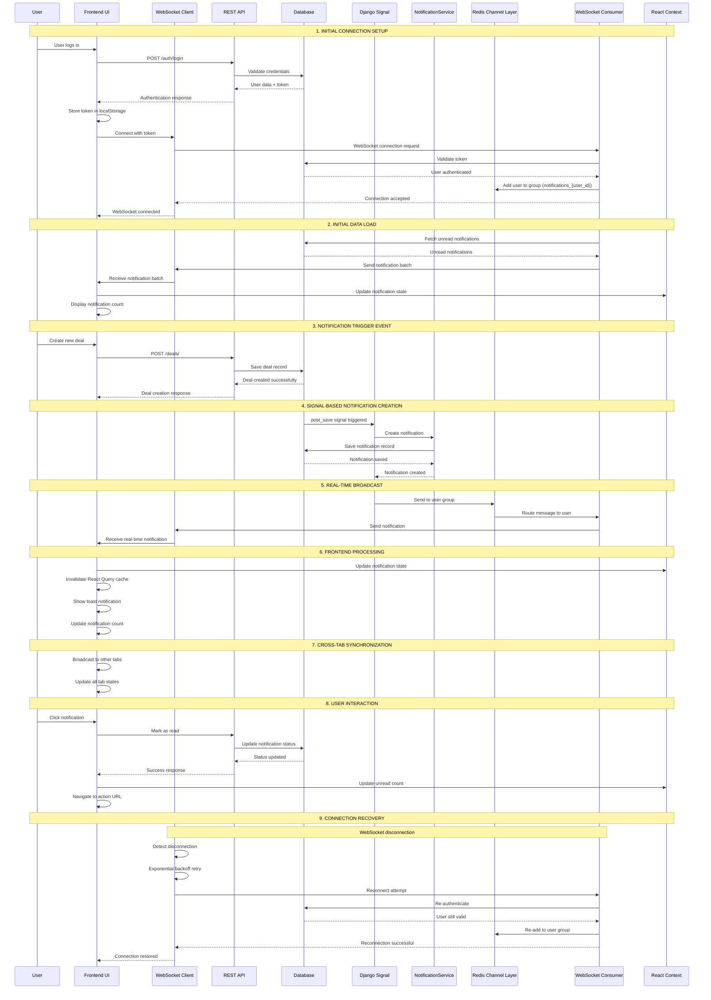
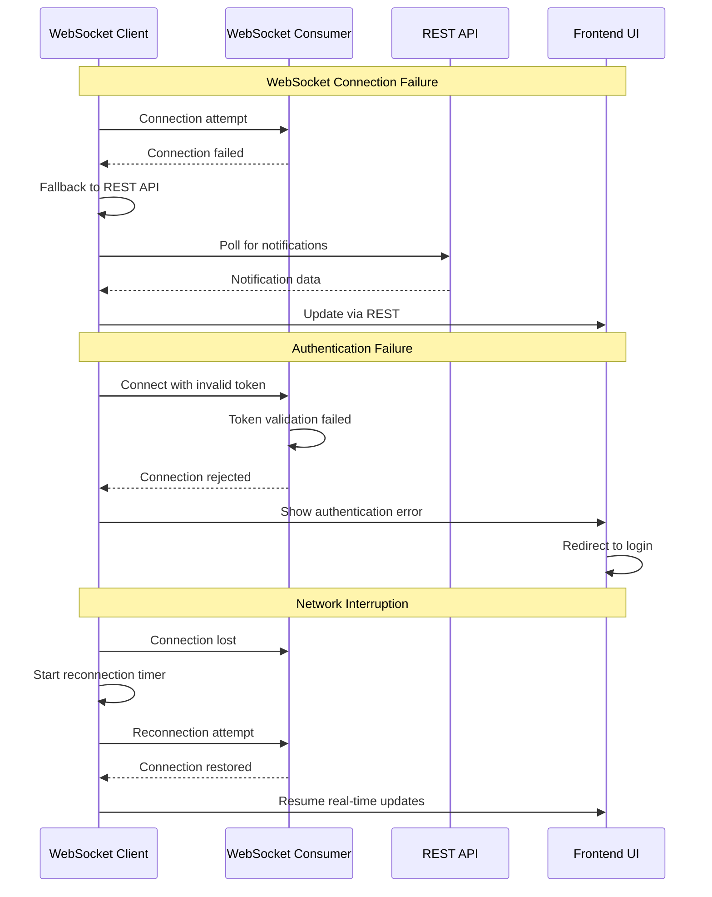

# Real-Time Notification System - Sequence Diagram

## Overview
This sequence diagram illustrates the complete flow of the real-time notification system, from the initial trigger event to the final UI update.

## Sequence Diagram

## Detailed Component Interactions

### 1. **Initial Connection Setup**
- User authentication triggers WebSocket connection
- Token-based authentication ensures secure connections
- User-specific groups created for targeted messaging

### 2. **Initial Data Load**
- On connection, backend sends existing unread notifications
- Frontend populates notification state immediately
- No additional API calls needed for initial data

### 3. **Notification Trigger Event**
- Any database operation can trigger notifications
- Examples: deal creation, payment received, user actions
- REST API handles the primary operation

### 4. **Signal-Based Notification Creation**
- Django signals automatically detect database changes
- NotificationService creates appropriate notifications
- Supports templates, user preferences, and role-based targeting

### 5. **Real-Time Broadcast**
- Redis channel layer routes messages efficiently
- User-specific groups ensure targeted delivery
- WebSocket consumer handles message formatting

### 6. **Frontend Processing**
- React Query cache invalidation ensures UI consistency
- Toast notifications provide immediate user feedback
- Context updates maintain global state

### 7. **Cross-Tab Synchronization**
- BroadcastChannel API synchronizes across browser tabs
- All tabs receive the same notification updates
- Consistent user experience across multiple tabs

### 8. **User Interaction**
- Click handlers navigate to relevant pages
- Mark-as-read operations update backend state
- Real-time updates reflect user actions

### 9. **Connection Recovery**
- Automatic reconnection with exponential backoff
- Graceful handling of network interruptions
- Seamless user experience during connectivity issues

## Key Features Highlighted

### **Real-Time Delivery**
- WebSocket-based instant messaging
- Redis channel layer for scalability
- User-specific message routing

### **Reliability**
- Automatic reconnection strategies
- Fallback to REST API when needed
- Error handling and recovery

### **Performance**
- Efficient cache invalidation
- Batch notification processing
- Optimized database queries

### **User Experience**
- Immediate visual feedback
- Cross-tab synchronization
- Priority-based notification styling

### **Security**
- Token-based authentication
- User-specific message groups
- Secure WebSocket connections

## Error Handling Scenarios

This sequence diagram provides a comprehensive view of how the real-time notification system works, from initial setup through various interaction scenarios and error handling. 